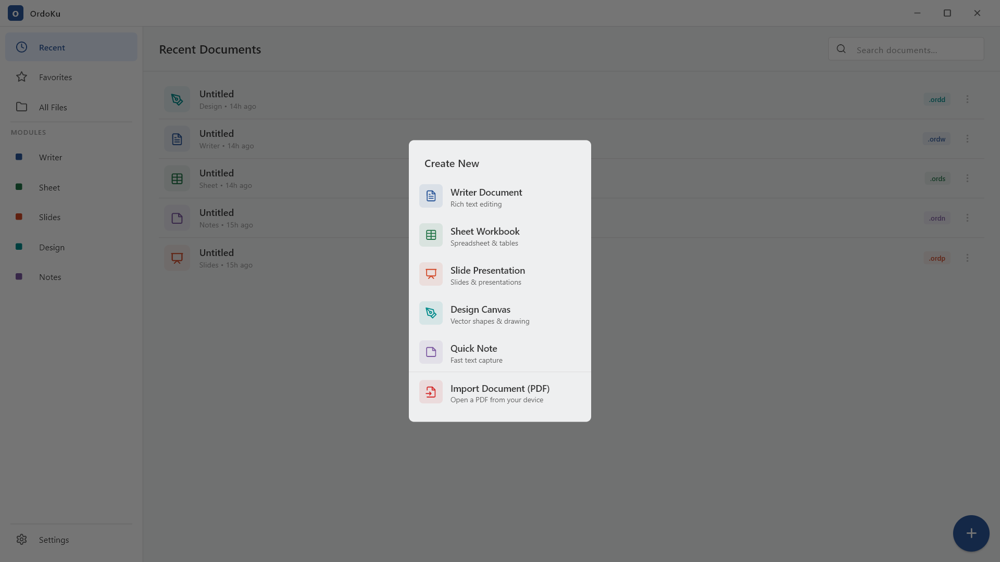

# OrdoKu


OrdoKu is an offline-first desktop office suite built with Flutter. It focuses on providing a local, private workspace for document creation and file management without requiring an internet connection.

## Preview



## Features

- **Document Writer:** A text processor tailored for local document drafting.
- **Offline Environment:** Data is stored locally using SQLite and Hive, ensuring privacy.
- **File Management:** Built-in system for navigation, custom file naming, and organization.
- **Distraction-Free Mode:** Fullscreen support via the F11 key.

## Technical Stack

- **Framework:** Flutter
- **State Management:** Riverpod
- **Routing:** GoRouter
- **Storage:** Hive & sqflite
- **Editor:** Flutter Quill

## Getting Started

### Prerequisites

- Flutter SDK (>= 3.11.4)

### Installation

1. Clone the repository:
   ```bash
   git clone https://github.com/arcynith/ordoku.git
   ```
2. Navigate to the project directory:
   ```bash
   cd ordoku
   ```
3. Install dependencies:
   ```bash
   flutter pub get
   ```
4. Run the application:
   ```bash
   flutter run
   ```

## License

This project is open source and available under the [MIT License](LICENSE).
